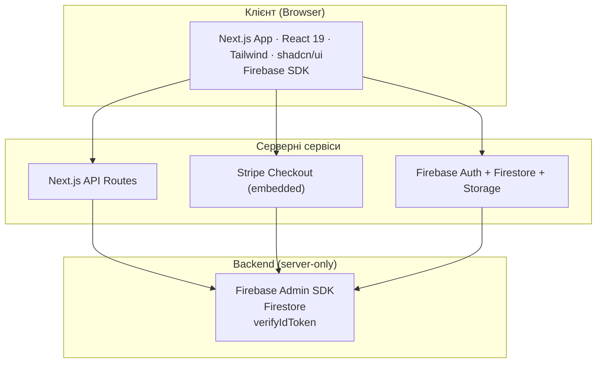
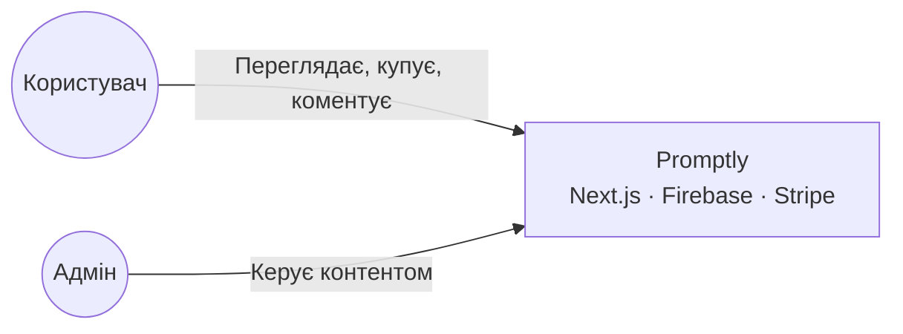
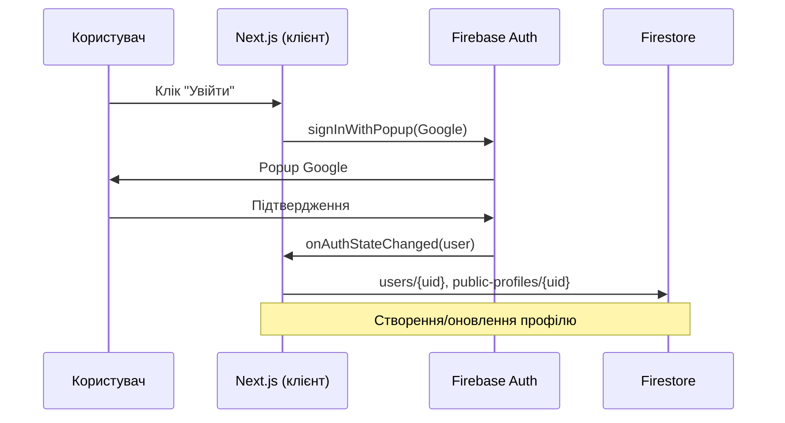
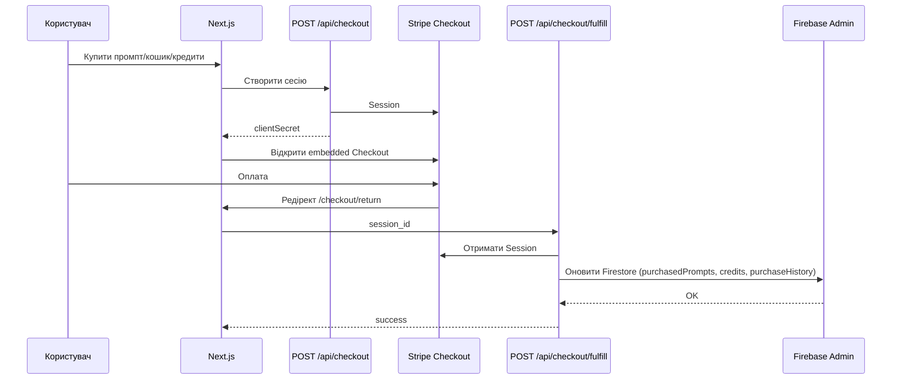
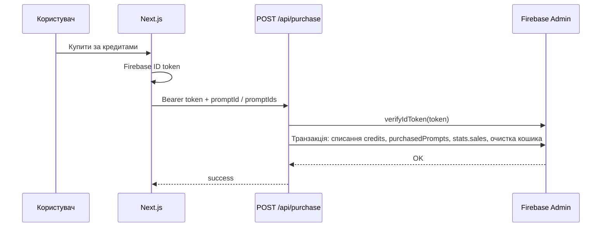

# Архітектура

## Високорівнева схема

## Контекст системи

## Потік авторизації

## Потік оплати (Stripe)

## Потік покупки за кредитами

## Потоки даних

1. **Читання даних (публічні)**  
   Клієнт → Firebase SDK → Firestore (промпти, категорії, теги, типи, моделі, публічні профілі). Правила доступу та індекси описані в [04-database.md](04-database.md) та [05-auth-security.md](05-auth-security.md).

2. **Авторизація**  
   Клієнт → Firebase Auth (Google popup) → після логіну створюється/оновлюється документ `users/{uid}` та при потребі `public-profiles/{uid}` (через клієнт або backend).

3. **Оплата**  
   Клієнт → `POST /api/checkout` (створення Stripe Session) → Stripe Checkout (embedded) → після успіху редірект на `/checkout/return` → виклик `POST /api/checkout/fulfill` (webhook-подібний flow) → Firebase Admin оновлює Firestore (purchasedPrompts, orders, purchaseHistory, credits тощо).

4. **Покупка за кредити**  
   Клієнт (з ID token) → `POST /api/purchase` (promptId або promptIds для кошика) → Firebase Admin у транзакції списує кредити, додає purchasedPrompts, оновлює stats.sales, очищає кошик, пише purchaseHistory.

5. **Адмін-дії**  
   Клієнт → Next.js API routes або Server Actions (`admin/prompts/actions.ts`) → перевірка ролі через Firestore (role === 'admin') → Firebase Admin для запису в Firestore/Storage.

6. **AI (теги)**  
   Адмін/скрапер → Genkit flow `suggestRelevantTags` → Google GenAI → повертає suggested tags.

## Роль Next.js

- **App Router** — усі сторінки та API routes під `src/app/`.
- **Server Components за замовчуванням** — сторінки рендеряться на сервері; клієнтські частини (Firebase Auth, форми, Stripe UI) — `'use client'`.
- **Middleware** — у проєкті не використовується (немає файлу `middleware.ts`).
- **API Routes** — REST-подібні handlers у `src/app/api/*/route.ts` для checkout, purchase, CRUD категорій/тегів/типів/моделей, search-bar-backgrounds тощо.

## Роль Firebase

- **Auth** — лише Google; ідентифікація користувача для захищених API та правил Firestore/Storage.
- **Firestore** — основне сховище: users, public-profiles, prompts (і subcollections private, comments), categories, tags, types, models, carts, orders, purchaseHistory, searchBarBackgrounds, scraped_prompts.
- **Storage** — зображення промптів (`prompts/*`), аватари/обкладинки (`users/{uid}/avatar|cover`), фони пошуку (`searchBarBackgrounds/*`).

## Роль Stripe

- Створення Checkout Session (payment, embedded).
- Типи товарів: один промпт, кошик, кредити, підписки (Starter/Pro, monthly/yearly).
- Після оплати — fulfill API оновлює Firestore (credits, purchasedPrompts, orders, purchaseHistory).

Деталі фронту, бекенду та БД: [02-frontend.md](02-frontend.md), [03-backend.md](03-backend.md), [04-database.md](04-database.md).
