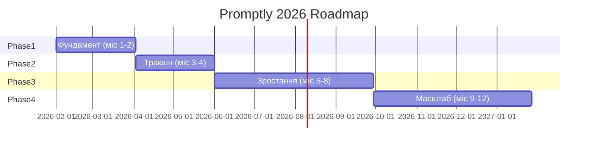

# Стратегія 2026 — Короткий огляд

> Спрощений стратегічний план для Promptly. Відстежуйте прогрес у [Дашборді](/docs/dashboard).

---

## Коротко

| Параметр | Значення |
|----------|----------|
| **Ринок** | $7,92 млрд до 2032 (25–27% CAGR) |
| **Головна проблема** | Порожній каталог вбиває конверсію |
| **Головна перевага** | Generate + Marketplace (спробуй → згенеруй → купи) |
| **Ціль на 6 місяців** | €500–1,5K MRR, 100+ платних клієнтів |
| **Стартовий бюджет** | €3K–5K (бутстреп) |

---

## Що потрібно мати (пріоритет)

### Tier 1 — Робити зараз

- [ ] Засіяти 200–300 промптів (вручну або з креаторами)
- [ ] Залучити 30 креаторів через outreach
- [ ] Створити 10–15 GEO-сторінок (видимість в AI-пошуку)
- [ ] Виправити Empty State — замінити «No prompts found» на CTA + Generate
- [ ] Додати «Спробуй Promptly зараз» — миттєва демо на головній

### Tier 2 — Після першого доходу

- [ ] Лідерборд креаторів, бандли, кейс-стаді
- [ ] Реферальні кредити, рейтинги, кнопка «Remix»

### Tier 3 — Лише після PMF

- [ ] B2B плани, API, університети
- [ ] Платна реклама, enterprise-функції

---

## Таймлайн (фази)

| Фаза | Період | Цілі |
|------|--------|------|
| **Фаза 1** | Місяці 1–2 | 200–300 промптів, 30 креаторів, 10–15 GEO-сторінок, виправити Empty State |
| **Фаза 2** | Місяці 3–4 | 1 000+ промптів, 500+ користувачів, перші платні конверсії, контент-маркетинг |
| **Фаза 3** | Місяці 5–8 | 5 000+ промптів, €1K+ MRR, тести платного залучення, івенти спільноти |
| **Фаза 4** | Місяці 9–12 | 20 000+ промптів, €5K+ MRR, B2B плани, API |

---

## Вибір ніші (критично)

| Варіант | Плюси | Ризики | Рекомендація |
|---------|-------|--------|--------------|
| **A. Маркетинг і SEO** | Платоздатна аудиторія, швидший ROI | Перетин з AIPRM | Оптимально для старту |
| **B. Освіта** | Переваги ЄС, інституційні угоди | Довший цикл продажів | Добре для Фази 2 |
| **C. Дизайн / Зображення** | Віральність, популярність Midjourney | Висока конкуренція | Якщо A не спрацює |

**Позиціонування:** «Promptly — найкраще місце для промптів [ніша].»

---

## GEO (AI-пошук)

Цільова видимість у:

- ChatGPT Search
- Google AI Overviews
- Perplexity
- Gemini

**Структура контенту, яку віддають перевагу LLM:**

- Чіткі H2/H3 у форматі Q&A
- Чек-листи, плюси/мінуси, цифри
- FAQ з прямими відповідями
- HTML з серверної сторони

---

## Бюджет (6 місяців)

| Категорія | На місяць | Всього |
|-----------|-----------|--------|
| Інфраструктура | ~€100 | €600 |
| Інcentive / баунті | ~€300 | €1 800 |
| Інструменти (аналітика, SEO) | ~€100 | €600 |
| **Всього бутстреп** | **~€500** | **€3 000** |

---

## Бест-практики (Google, Microsoft, Apple)

1. **Один фокус** — Контент + GEO першим. Все інше — Tier 2–3.
2. **Орієнтація на дані** — Щотижневий дашборд, PMF radar, чіткі метрики.
3. **Швидкі ітерації** — 1–2 експерименти на тиждень на найслабшому сегменті.
4. **Цінність до реєстрації** — Дозвольте користувачам створювати перед реєстрацією.
5. **Доводьте цінність щомісяця** — Показуйте результати, а не обіцянки.

---

*Дивіться [Повний план команди](/docs/team-plan) для деталей та [Дашборд](/docs/dashboard) для прогресу.*
